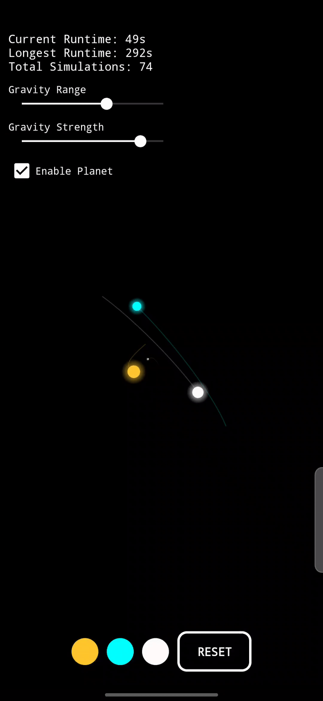

# Three Body Problem Simulation



An interactive Android application that simulates the classical three-body gravitational problem with an innovative reflective planet feature. This project demonstrates complex gravitational interactions between celestial bodies while providing an engaging and visually appealing user experience.

> **Note:** This is an entertainment-focused simulation designed for visual appeal and interactive fun. While it uses basic gravitational formulas, it does not accurately represent real astronomical physics. The parameters, forces, and visual effects have been heavily modified to create an engaging experience rather than a scientifically accurate model. For educational purposes, please refer to proper astronomical physics resources.

## Features

### Core Simulation
- Real-time physics simulation of three gravitational bodies
- Smooth particle trails showing movement history
- Automatic simulation reset when bodies drift off-screen
- Persistent statistics tracking (runtime, longest run, total simulations)

### Interactive Controls
- Adjustable gravity strength (0.01-100.0 units)
- Adjustable gravity range (0.1-1000 units)
- Color customization for each star using a color picker
- Optional reflective planet toggle

### Visual Effects
- Dynamic light reflection from the nearest star
- Smooth color transitions and mixing from multiple stars
- Particle trails with fade-out effects
- Automatic camera tracking and zooming

### Reflective Planet
- Small planet that responds to gravitational fields
- Does not affect the stars' trajectories
- Reflects light from nearby stars with smooth color transitions
- Displays movement trails with color matching current state

## Technical Details

### Physics Implementation
The simulation implements gravitational interactions using the following approach:
- Inverse square law for gravitational force calculation
- Velocity-based movement with position updates
- Collision avoidance through minimum distance thresholds
- Optimized force calculations with maximum limits

### Rendering
- Custom SurfaceView implementation for efficient rendering
- Hardware-accelerated graphics
- Double-buffered drawing for smooth animation
- Gradient-based star and planet rendering

### Performance Optimizations
- Efficient trail management with fixed-size lists
- Optimized collision detection
- Smart reset logic based on visibility bounds
- Smooth camera tracking with ease-in transitions

## Usage

1. Launch the application
2. Use the sliders to adjust gravity parameters:
   - Left slider: Gravity range (0.1-1000)
   - Right slider: Gravity strength (0.01-100.0)
3. Tap the colored buttons to customize star colors
4. Toggle the reflective planet checkbox to add/remove the planet
5. Watch the simulation and statistics in real-time

## Implementation Notes

### Gravity Calculations
```kotlin
val force = min((a.mass * b.mass * G) / (distance * distance), 200000f) * 0.25f
```
The gravitational force is calculated using Newton's law of universal gravitation, with added constraints to prevent numerical instability.

### Color Mixing
```kotlin
private fun interpolateColor(color1: Int, color2: Int, fraction: Float): Int {
    val r1 = Color.red(color1)
    val g1 = Color.green(color1)
    val b1 = Color.blue(color1)
    val r2 = Color.red(color2)
    val g2 = Color.green(color2)
    val b2 = Color.blue(color2)

    val r = (r1 + (r2 - r1) * fraction).toInt()
    val g = (g1 + (g2 - g1) * fraction).toInt()
    val b = (b1 + (b2 - b1) * fraction).toInt()

    return Color.rgb(r, g, b)
}
```
Smooth color transitions are achieved through linear interpolation in RGB space.

## Requirements

- Android 5.0 (API level 21) or higher
- OpenGL ES 2.0 support
- Hardware-accelerated graphics

## Building

1. Clone the repository
2. Open the project in Android Studio
3. Sync Gradle files
4. Build and run on your device or emulator

## License

This project is licensed under the MIT License - see the LICENSE file for details.

## Acknowledgments

- Inspired by the classical three-body problem in physics
- Color picker implementation using AmbilWarna library
- Material Design components for UI elements

---